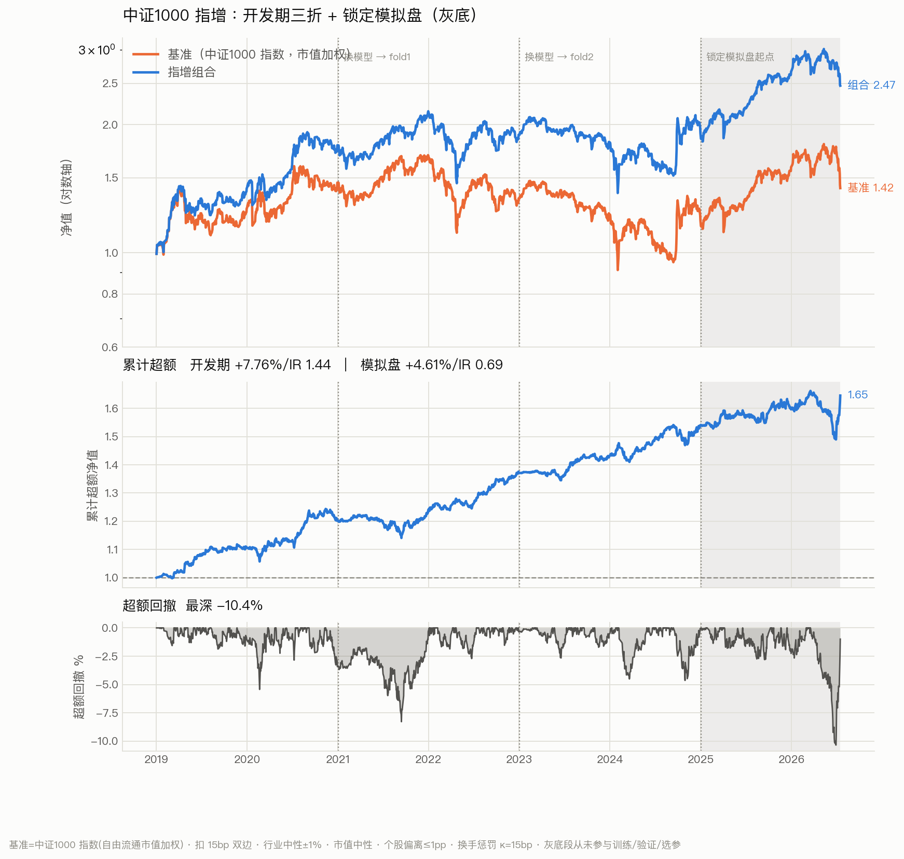

# Deep Index Enhancement — 中证1000 指数增强

用深度学习产出**日频截面因子**，经风险模型与带约束优化构成中证1000 指数增强组合。

- **结果** → [RESULTS.md](RESULTS.md)
- **方案** → [docs/plan.pdf](docs/plan.pdf)（源文件 `docs/plan.tex`，`xelatex` 编译）



## 一句话结论

开发期（2019–2024，三折 walk-forward）超额年化 **+7.76%**、IR **1.44**；
从未参与训练/验证/选参的锁定模拟盘（2025-01 ~ 2026-07）超额 **+4.61%**、IR **0.69**、NW-t **0.74**。

模拟盘确认了**没有灾难性失效**，但 372 天的样本量**不足以确认收益水平**——
IR 的标准误约 0.82，区分不开「真实 IR 1.44 但运气差」与「真实 IR 接近 0」。

## 流水线

```
面板对齐 ─→ 特征(30维) ─┐
                        ├─→ L0 时序编码器 ─→ 打分 ─→ 截面中性化
标签(h日残差收益) ───────┘                              │
                                                        ▼
风险模型(Country+行业38+Size+Beta) ──────────→ 带约束优化 ─→ 指增组合
```

**信号层**（Grinold-Kahn）

```
z = Φ⁻¹((rank(s) − 0.5)/N),  clip ±3
α = IC_rolling × √(σ²_spec · h)/h × z
```

`IC_rolling` 取过去 252 日 RankIC 均值 × 0.6 收缩，窗口**截到 i−h** 防前视。

**优化**

```
max  α'w − λ/2 · (w−w_b)'Σ(w−w_b) − κ‖w−w_prev‖₁
s.t. Σw = 1,  0 ≤ w ≤ w_b + 1pp
     |行业暴露 − 基准| ≤ 1%,  |Size 暴露 − 基准| ≤ 0.1
```

换手是**惩罚项不是硬约束**——它代表成本，做成约束会与个股/行业约束冲突导致无解。

## 目录

```
src/
  config.py              路径、样本期、代码映射、板块与涨跌停规则、特征参数
  fetch_meta.py          ST 与申万行业（cjpy/天软，月末采样，断点续跑）
  build_panels.py        面板对齐、掩码构造、与旧 mask 的交叉校验
  build_features.py      9 个价格特征 + 252 日 MAD 稳健裁剪
  build_features_ext.py  21 个扩充特征（量/换手/波动/日内隔夜/流动性/极值）
  build_labels.py        h 日残差收益标签（逐日截面对市值+行业正交化）
  verify.py              六组验收测试
  splits.py              时间切分 + 锁定模拟盘强制校验
  dataset.py             面板 → 张量（按天批，截面 rank 标准化）
  model.py               L0/L1A/L1B/L2 四级，属性 embedding
  loss.py                截面 IC + 排序 hinge；λ 平滑、换手、Newey-West
  train.py               walk-forward × 多种子，预测落盘
  risk.py                Barra 式风险模型（窄版）
  costs.py               A 股成本（印花税单边/佣金/半价差/平方根冲击）
  portfolio.py           训练集成 + 分位回测 + 多空拆解
  optimize.py            信号层 + 带约束优化 + 指增回测
  analyze.py             三折拼接、多空、暴露归因
  plot_backtest.py       回测曲线
docs/    plan.tex/pdf · archive/(v1) · 回测图
runs/    ablation/(消融 json) · portfolio/(预测与收益序列)
```

`data/`（3.5GB）与 `runs/**/*.npz` 不入库，可由 `src/` 完整重建。

## 复现

```bash
pip install -r requirements.txt

# 数据层（源面板见 src/config.py:SRC_PRICE）
python3 -u src/build_panels.py
python3 -u src/build_features.py
python3 -u src/build_features_ext.py
python3 -u src/build_labels.py
python3 -u src/verify.py            # 18 项，任一 FAIL 即不得继续

# 模型（GPU 约 20 分钟；CPU 不可行）
python3 -u src/train.py --level L0 --h 5 --feature-set full --device cuda \
                       --seeds 12 --iters 300 --batch-days 16

# 组合（纯 CPU）
python3 -u src/risk.py
python3 -u src/portfolio.py --level L0 --h 5 --feature-set full --device cuda
python3 -u src/optimize.py --folds 0,1,2
python3 -u src/plot_backtest.py
```

## 锁定模拟盘

**2025-01-02 起的数据从未参与训练、验证、超参搜索、种子排序、早停或任何统计量估计。**

代码强制：`splits.assert_no_lockbox()` 在所有取数路径上校验日期，越界抛 `LockboxViolation`，
唯一放行入口是 `purpose="paper"`。

该区间已于 2026-08 使用一次（`--final`）。**它现在不再干净**——
任何看过该结果之后所做的调整都会污染它。后续改进必须在验证段上判断，
并另行划定新的锁定区间。

## 已知限制

1. **模拟盘 372 天不足以确认收益水平**（IR 标准误 ≈ 0.82）。
2. **消融是在测试集上做的**，h/回看/特征的选择已污染 2019–2024 六年。
3. **风险模型是窄版**：只有 Country + 行业 + Size + Beta，缺 Barra 的
   Momentum / ResVol / Liquidity / BP 与财务三因子；也未做 eigenfactor、
   volatility regime、bias test 三项调整。
4. **超参从未搜索**：`d/lr/dropout/λ/κ/容忍度` 全是默认值。
5. **成本模型未用真实价差**：半价差取常数 5bp 下限，需 Level-1 快照才能标定。
6. **ST 状态按月末采样**，转换日期解析到「月」粒度。
